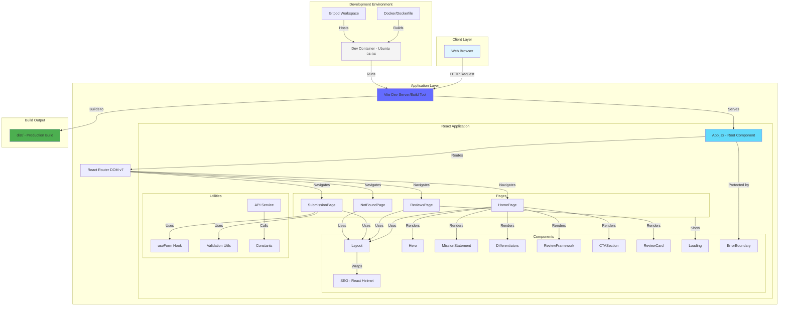
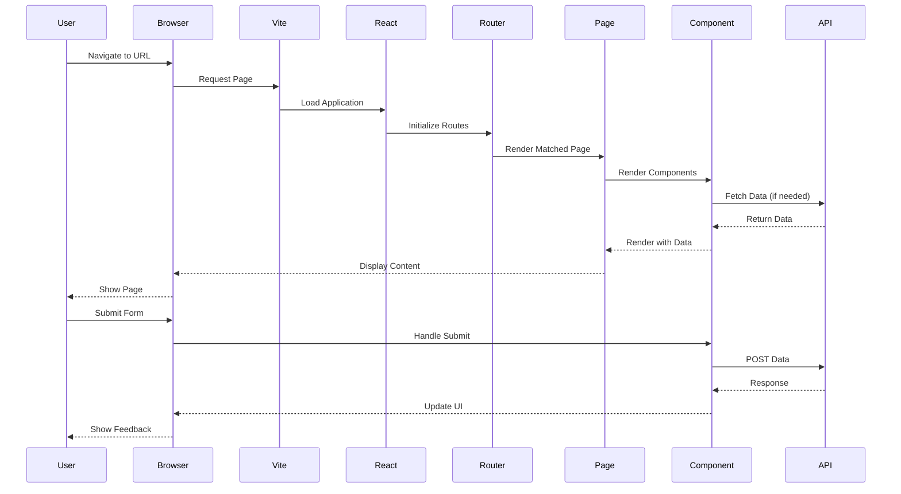

# System Architecture

## Overview

Dobeu.info is a React-based web application for providing honest, independent software reviews. The system is built with modern web technologies and follows a component-based architecture.

## System Architecture Diagram



## Component Hierarchy

```mermaid
graph TD
    Main[main.jsx - Entry Point] --> App[App.jsx]
    App --> ErrorBoundary[ErrorBoundary]
    ErrorBoundary --> Router[React Router]
    
    Router --> HomePage[HomePage]
    Router --> ReviewsPage[ReviewsPage]
    Router --> SubmissionPage[SubmissionPage]
    Router --> NotFoundPage[NotFoundPage]
    
    HomePage --> Layout1[Layout]
    ReviewsPage --> Layout2[Layout]
    SubmissionPage --> Layout3[Layout]
    NotFoundPage --> Layout4[Layout]
    
    Layout1 --> SEO1[SEO]
    Layout1 --> Hero
    Layout1 --> Mission[MissionStatement]
    Layout1 --> Diff[Differentiators]
    Layout1 --> Framework[ReviewFramework]
    Layout1 --> CTA[CTASection]
    
    Layout2 --> SEO2[SEO]
    Layout2 --> ReviewCard[ReviewCard]
    
    Layout3 --> SEO3[SEO]
    Layout3 --> Form[Form with useForm]
    
    Layout4 --> SEO4[SEO]
    
    style Main fill:#282c34
    style App fill:#61dafb
    style ErrorBoundary fill:#ff6b6b
    style Router fill:#ca4245
    style Layout1 fill:#4ecdc4
    style Layout2 fill:#4ecdc4
    style Layout3 fill:#4ecdc4
    style Layout4 fill:#4ecdc4
```



## Data Flow



## Development Workflow

```mermaid
graph LR
    subgraph "Local Development"
        Code[Write Code] --> Git[Git Commit]
        Git --> Push[Push to GitHub]
    end
    
    subgraph "Gitpod Environment"
        DevContainer[Dev Container] --> Install[npm install]
        Install --> Dev[npm run dev]
        Dev --> Test[Manual Testing]
        Test --> Build[npm run build]
    end
    
    subgraph "Deployment"
        Build --> Dist[dist/ folder]
        Dist --> Deploy[Deploy to Hosting]
        Deploy --> Live[Live Site]
    end
    
    Push --> DevContainer
    
    style Code fill:#4caf50
    style DevContainer fill:#f4f4f4
    style Live fill:#2196f3
```



## Technology Stack

```mermaid
graph TB
    subgraph "Frontend"
        React[React 19.2.3]
        ReactDOM[React DOM 19.2.3]
        ReactRouter[React Router DOM 7.10.1]
        ReactHelmet[React Helmet Async 2.0.5]
    end
    
    subgraph "Build Tools"
        Vite[Vite 7.2.4]
        ViteReact[@vitejs/plugin-react 5.1.2]
        TypeScript[TypeScript 5.9.3]
    end
    
    subgraph "Development Environment"
        DevContainer[Dev Container]
        Ubuntu[Ubuntu 24.04]
        Node[Node.js]
        Docker[Docker]
    end
    
    subgraph "Version Control"
        Git[Git]
        GitHub[GitHub Repository]
        Gitpod[Gitpod Workspace]
    end
    
    React --> Vite
    ReactDOM --> Vite
    ReactRouter --> Vite
    ReactHelmet --> Vite
    ViteReact --> Vite
    TypeScript --> Vite
    
    Vite --> DevContainer
    DevContainer --> Ubuntu
    Ubuntu --> Node
    Ubuntu --> Docker
    
    Git --> GitHub
    GitHub --> Gitpod
    Gitpod --> DevContainer
    
    style React fill:#61dafb
    style Vite fill:#646cff
    style DevContainer fill:#f4f4f4
    style GitHub fill:#181717
```

## File Structure

```mermaid
graph TD
    Root[dobeuinfo-app/] --> Public[public/]
    Root --> Src[src/]
    Root --> DevContainer[.devcontainer/]
    Root --> Config[Configuration Files]
    
    Src --> Components[components/]
    Src --> Pages[pages/]
    Src --> Hooks[hooks/]
    Src --> Services[services/]
    Src --> Utils[utils/]
    Src --> Styles[styles/]
    Src --> AppFiles[App.jsx, main.jsx]
    
    Components --> Hero[Hero.jsx]
    Components --> Layout[Layout.jsx]
    Components --> SEO[SEO.jsx]
    Components --> Others[Other Components...]
    
    Pages --> HomePage[HomePage.jsx]
    Pages --> ReviewsPage[ReviewsPage.jsx]
    Pages --> SubmissionPage[SubmissionPage.jsx]
    Pages --> NotFoundPage[NotFoundPage.jsx]
    
    Hooks --> UseForm[useForm.js]
    Services --> API[api.js]
    Utils --> Validation[validation.js]
    Utils --> Constants[constants.js]
    Styles --> Global[global.css]
    
    DevContainer --> Dockerfile[Dockerfile]
    DevContainer --> DevContainerJSON[devcontainer.json]
    
    Config --> Package[package.json]
    Config --> Vite[vite.config.js]
    Config --> TS[tsconfig.json]
    Config --> GitIgnore[.gitignore]
    Config --> README[README.md]
    
    style Root fill:#4caf50
    style Src fill:#2196f3
    style Components fill:#ff9800
    style Pages fill:#9c27b0
    style DevContainer fill:#f4f4f4
```



## Key Features

1. **Component-Based Architecture**: Modular, reusable React components
2. **Client-Side Routing**: React Router DOM for navigation
3. **SEO Optimization**: React Helmet Async for meta tags
4. **Error Handling**: ErrorBoundary component for graceful error handling
5. **Form Management**: Custom useForm hook for form state
6. **API Integration**: Centralized API service layer
7. **Validation**: Utility functions for input validation
8. **Loading States**: Loading component for async operations
9. **Responsive Design**: CSS-based responsive layouts
10. **Dev Container**: Consistent development environment

## Deployment Architecture

```mermaid
graph LR
    subgraph "Source"
        GitHub[GitHub Repository]
    end
    
    subgraph "Build"
        CI[CI/CD Pipeline]
        Build[npm run build]
        Dist[dist/ folder]
    end
    
    subgraph "Hosting Options"
        Vercel[Vercel]
        Netlify[Netlify]
        GHPages[GitHub Pages]
        Custom[Custom Server]
    end
    
    subgraph "CDN"
        CDN[Content Delivery Network]
    end
    
    subgraph "Users"
        Browser[Web Browsers]
    end
    
    GitHub --> CI
    CI --> Build
    Build --> Dist
    Dist --> Vercel
    Dist --> Netlify
    Dist --> GHPages
    Dist --> Custom
    
    Vercel --> CDN
    Netlify --> CDN
    GHPages --> CDN
    Custom --> CDN
    
    CDN --> Browser
    
    style GitHub fill:#181717
    style Build fill:#4caf50
    style CDN fill:#ff9800
    style Browser fill:#2196f3
```

## Security Considerations

- No sensitive data in client-side code
- Environment variables for API keys (when needed)
- Input validation on forms
- Error boundary prevents app crashes
- HTTPS for production deployment
- CSP headers recommended for production

## Performance Optimizations

- Vite for fast builds and HMR
- Code splitting via React Router
- Lazy loading for routes (can be implemented)
- Optimized production builds
- Asset optimization via Vite
- React 19 performance improvements

## Future Enhancements

- Backend API integration
- Database for reviews storage
- User authentication
- Admin dashboard
- Review submission workflow
- Search functionality
- Filtering and sorting
- Analytics integration
- Testing suite (Jest, React Testing Library)
- CI/CD pipeline
- Monitoring and logging
